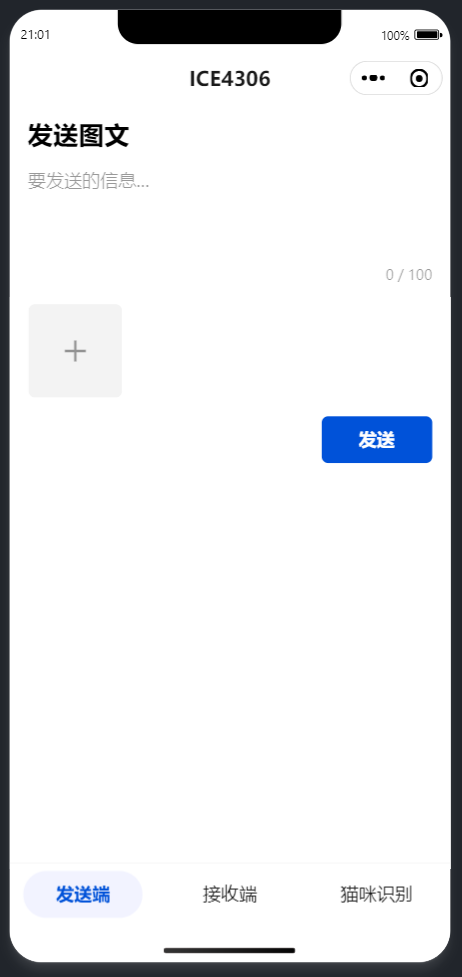
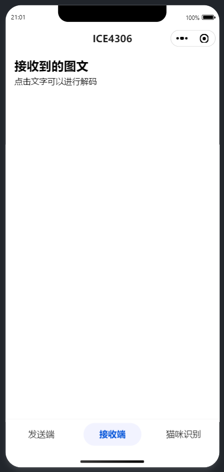
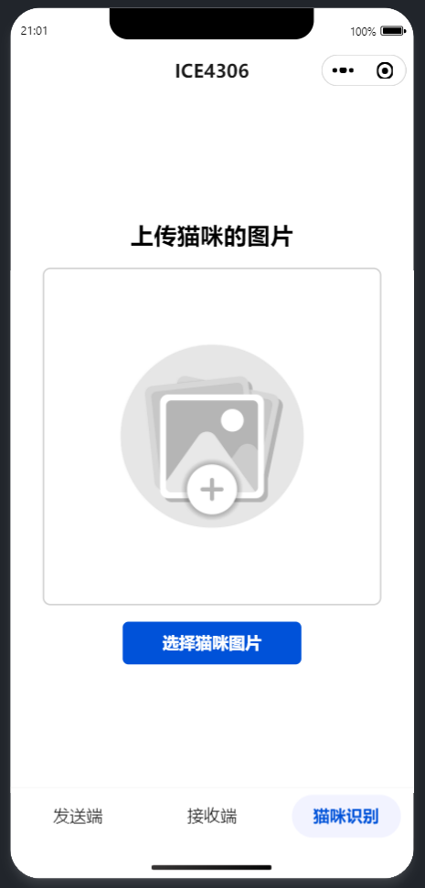
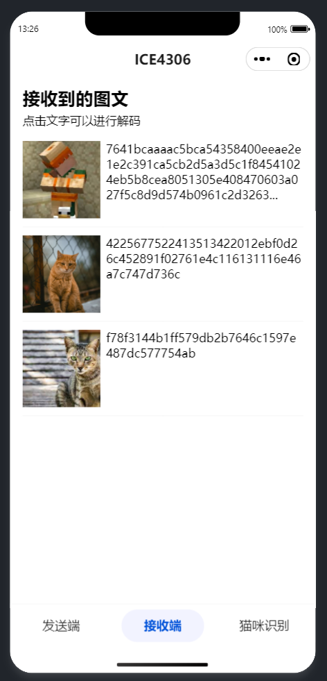
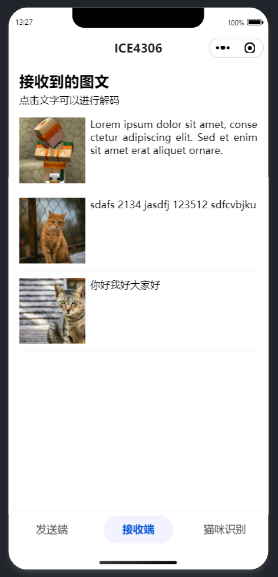
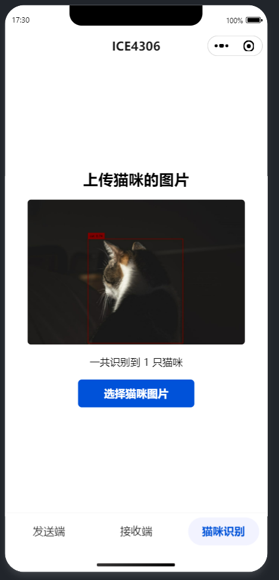
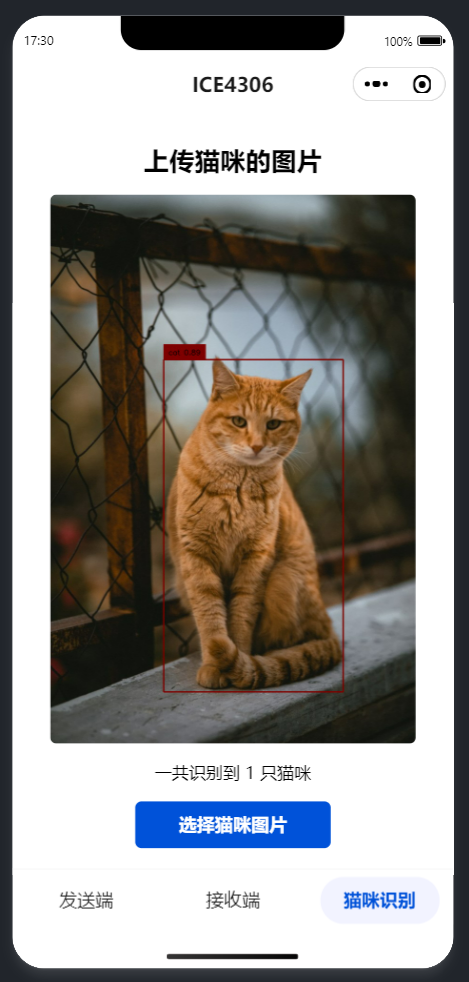
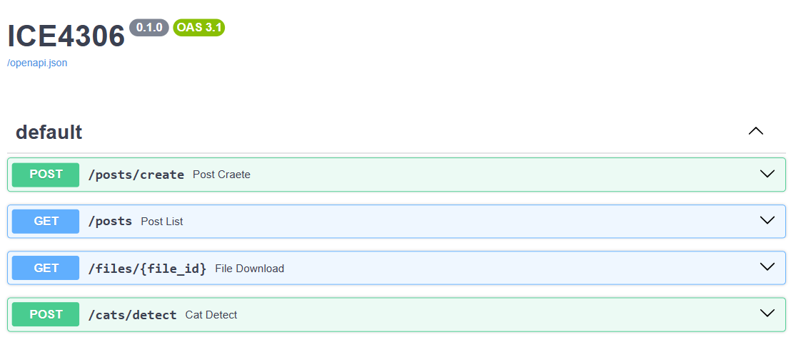

# ICE4306

## 安装

后端使用 `backend/install.sh` 安装后使用 `uvicorn main:app --reload --host 0.0.0.0` 运行，前端在微信开发者工具中打开。

## 配置

需要在 `backend/.env` 和 `frontend/app.ts` 中配置 `fastapi` 服务器的域名，将 `https://dev8000.lsla.cc` 改为使用的域名，还需要在微信小程序的后台中加入所使用的域名到 `request 合法域名` 和 `uploadFile 合法域名` 当中

## 前端截图

### 概览

前端一共有三个页面，分别是发送端、接收端和猫咪识别

    
    
    

### 接收端

在接收端中，可以看到发送过的图文列表，点击可解码文字

    
    

### 猫咪识别

猫咪识别页面可以上传猫咪并识别

    
    

## 后端接口

运行 fastapi 后可以通过 `http://localhost:8000/docs` 查看到 API 列表

